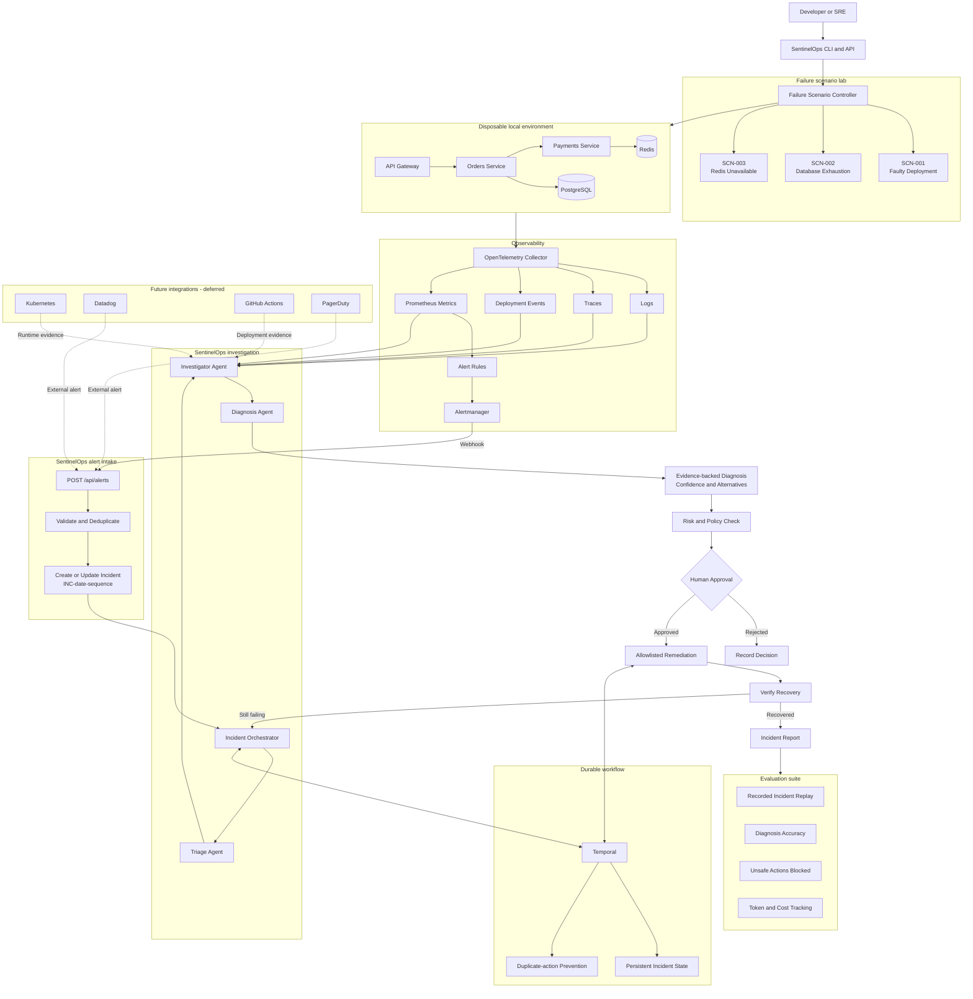

# SentinelOps architecture

This diagram describes the approved local-first product direction. Future
external connectors are shown for context but are not part of the initial
release.

```mermaid
flowchart TD
    User["Developer or SRE"] --> Interface["SentinelOps CLI and API"]

    subgraph Local["Disposable local environment"]
        Gateway["API Gateway"]
        Orders["Orders Service"]
        Payments["Payments Service"]
        Postgres[("PostgreSQL")]
        Redis[("Redis")]

        Gateway --> Orders
        Orders --> Payments
        Orders --> Postgres
        Payments --> Redis
    end

    subgraph Scenarios["Failure scenario lab"]
        Controller["Failure Scenario Controller"]
        I1["SCN-001<br/>Faulty Deployment"]
        I2["SCN-002<br/>Database Exhaustion"]
        I3["SCN-003<br/>Redis Unavailable"]

        Controller --> I1
        Controller --> I2
        Controller --> I3
    end

    Interface --> Controller
    Controller --> Local

    subgraph Telemetry["Observability"]
        OTel["OpenTelemetry Collector"]
        Logs["Logs"]
        Traces["Traces"]
        Events["Deployment Events"]
        Prometheus["Prometheus Metrics"]
        Rules["Alert Rules"]
        Alertmanager["Alertmanager"]

        OTel --> Logs
        OTel --> Traces
        OTel --> Events
        OTel --> Prometheus
        Prometheus --> Rules
        Rules --> Alertmanager
    end

    Local --> OTel

    subgraph Intake["SentinelOps alert intake"]
        Webhook["POST /api/alerts"]
        Validate["Validate and Deduplicate"]
        Incident["Create or Update Incident<br/>INC-date-sequence"]

        Webhook --> Validate
        Validate --> Incident
    end

    Alertmanager -->|"Webhook"| Webhook

    subgraph Agents["SentinelOps investigation"]
        Orchestrator["Incident Orchestrator"]
        Triage["Triage Agent"]
        Investigator["Investigator Agent"]
        Diagnosis["Diagnosis Agent"]

        Orchestrator --> Triage
        Triage --> Investigator
        Investigator --> Diagnosis
    end

    Incident --> Orchestrator
    Logs --> Investigator
    Traces --> Investigator
    Events --> Investigator
    Prometheus --> Investigator
    Diagnosis --> Findings["Evidence-backed Diagnosis<br/>Confidence and Alternatives"]
    Findings --> Risk["Risk and Policy Check"]
    Risk --> Approval{"Human Approval"}

    Approval -->|Rejected| Audit["Record Decision"]
    Approval -->|Approved| Remediation["Allowlisted Remediation"]
    Remediation --> Verify["Verify Recovery"]
    Verify -->|Recovered| Postmortem["Incident Report"]
    Verify -->|Still failing| Orchestrator

    subgraph Durability["Durable workflow"]
        Temporal["Temporal"]
        State["Persistent Incident State"]
        Idempotency["Duplicate-action Prevention"]

        Temporal --> State
        Temporal --> Idempotency
    end

    Orchestrator <--> Temporal
    Remediation <--> Temporal

    subgraph Evaluation["Evaluation suite"]
        Replay["Recorded Incident Replay"]
        Accuracy["Diagnosis Accuracy"]
        Safety["Unsafe Actions Blocked"]
        Cost["Token and Cost Tracking"]
    end

    Postmortem --> Evaluation

    subgraph Future["Future integrations - deferred"]
        Kubernetes["Kubernetes"]
        Datadog["Datadog"]
        GitHub["GitHub Actions"]
        PagerDuty["PagerDuty"]
    end

    Datadog -. "External alert" .-> Webhook
    PagerDuty -. "External alert" .-> Webhook
    Kubernetes -. "Runtime evidence" .-> Investigator
    GitHub -. "Deployment evidence" .-> Investigator
```
